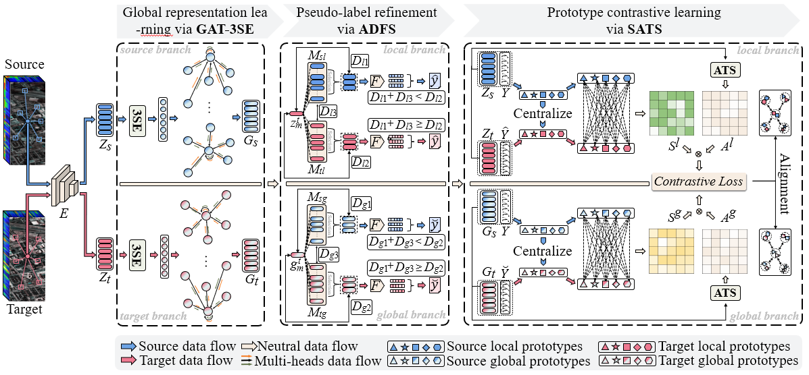
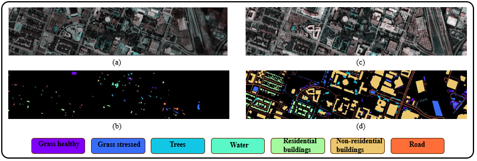
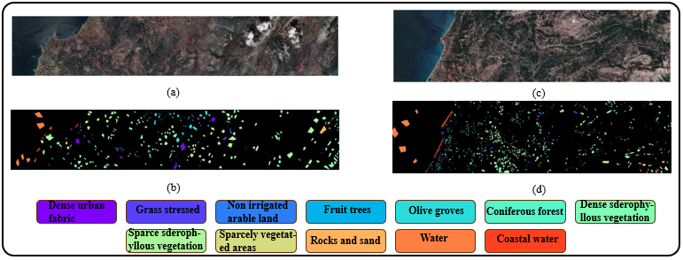
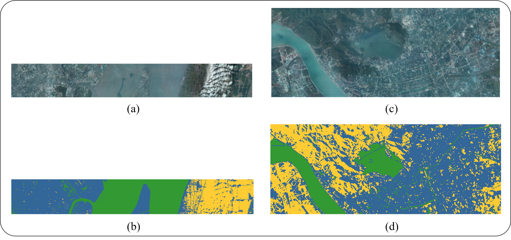

# Source-Driven Global-Local Prototype Contrastive Learning for Hyperspectral Domain Adaptation
Implementation of paper:
- [Source-Driven Global-Local Prototype Contrastive Learning for Hyperspectral Domain Adaptation](https://ieeexplore.ieee.org/abstract/document/11436091)  
  IEEE Transactions on Geoscience and Remote Sensing (IEEE TGRS), 2026.  
  Yuhao Xie, Ronghua Shang, Jinhong Ren, Jingyu Zhong, Jie Feng, Songhua Xu

<div align=center>
	
	<p>Framwork of SGLPCL. (Details of 3SE and ATS can be found in paper.) </p>
</div>

## Environment
Ubuntu 20.04.2 LTS, python 3.8.10, PyTorch 2.1.2.

## Datasets
Application website： [Houston, HyRANK, Shanghai-Hangzhou](https://github.com/YuxiangZhang-BIT/Data-CSHSI)
<div align="center">
  
  <p>(a),(b): False color and GT maps of Houston2013. (c), (d): False color and GT maps of Houston2018. </p>
</div>
<div align="center">
  
  <p>(a),(b): False color and GT maps of Dioni. (c), (d): False color and GT maps of Loukia. </p>
</div>
<div align="center">
  
  <p>(a),(b): False color and GT maps of Shanghai. (c), (d): False color and GT maps of Hangzhou. </p>
</div>

## Usage
```bash
cd code
python train.py
```

## Citation
If you find our paper or code helpful, please cite our work.
```bash
@ARTICLE{XieSGLPCL,
  author={Xie, Yuhao and Shang, Ronghua and Ren, Jinhong and Jingyu, Zhong and Feng, Jie and Xu, Songhua},
  journal={IEEE Transactions on Geoscience and Remote Sensing}, 
  title={Source-Driven Global-Local Prototype Contrastive Learning for Hyperspectral Domain Adaptation}, 
  year={2026},
  volume={},
  number={},
  pages={1-15},
  doi={10.1109/TGRS.2026.3674804}}
```

## Contributors
For any questions, feel free to open an issue or contact us:
- <a href="mailto:yaoxie1001@gmail.com">yaoxie1001@gmail.com</a>
